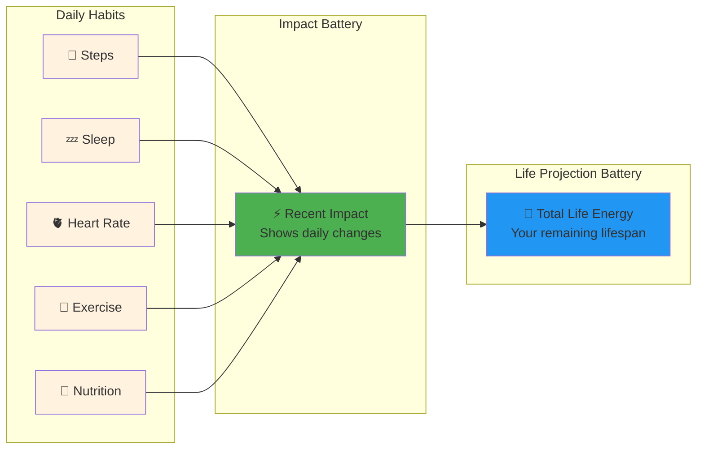
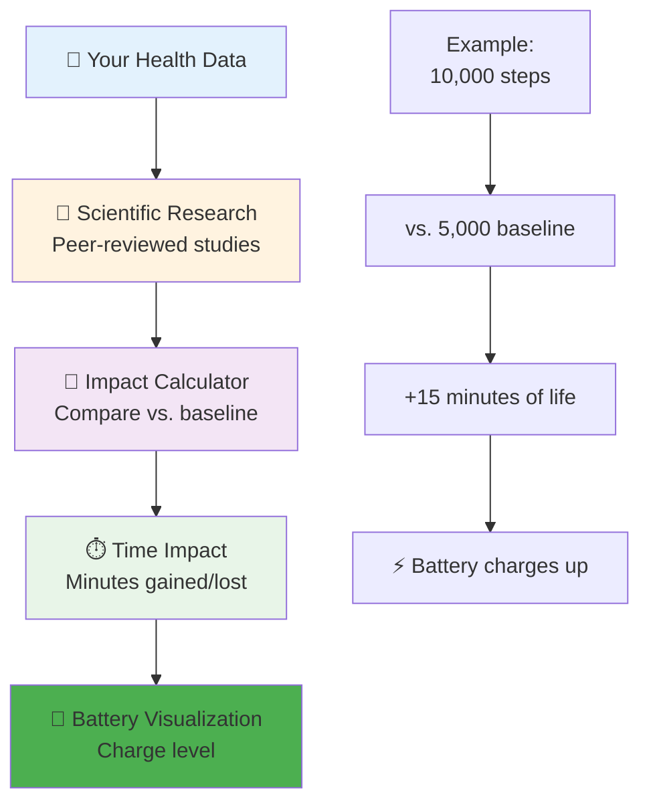
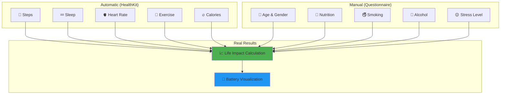
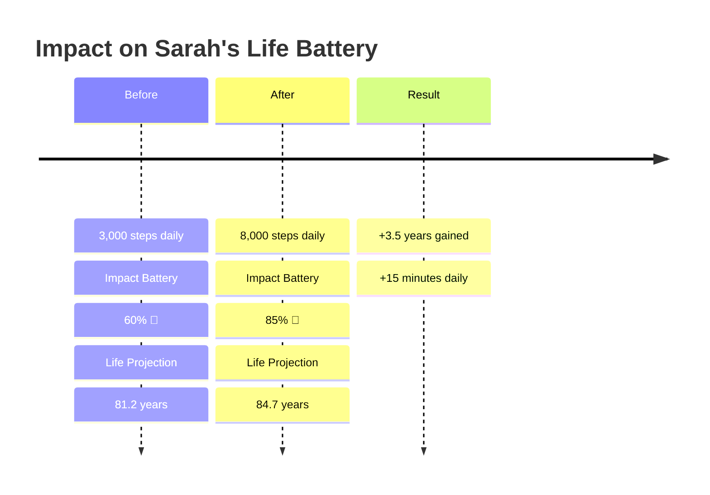

# Amped 🔋 Power Up Your Life

> **Transform your health habits into lifespan insights with science-backed calculations and beautiful battery visualizations.**

## ⚡ The Problem We Solve

**Do you ever wonder:** *"How much is this donut really costing me?"* or *"Am I actually adding years to my life with all this exercise?"*

Amped answers these questions by **turning your daily health choices into actual time gained or lost**, displayed through an intuitive battery interface that shows your health as energy levels.

---

## 🎯 How It Works

### Dual Battery System
Amped uses **two interconnected batteries** to show the complete picture of your health:



### The Science Behind Your Battery

Our algorithm converts your health data into **actual time gained or lost** using peer-reviewed research:



### What Makes Amped Different

🔬 **Science-First**: Every calculation backed by peer-reviewed research  
🏠 **Privacy-First**: All data stays on your device  
⚡ **Real-Time**: See instant impact from your daily choices  
🎯 **Actionable**: Know exactly what to improve

## 🎯 Key Features

### ⚡ Impact Battery
Shows how your **recent habits** affect your lifespan:
- 📈 **Daily View**: See today's gains/losses in real-time
- 📊 **Monthly View**: Track longer-term trends  
- 📅 **Yearly View**: Understand cumulative impact

### 🔋 Life Projection Battery  
Displays your **total remaining life energy**:
- 🎯 **Baseline Calculation**: Age + gender + demographics
- ➕ **Health Adjustments**: Modified by your actual health data
- ⏰ **Live Updates**: Changes as your habits improve/decline

### 📊 Smart Health Tracking



---

## 🚀 Real-World Example

**Sarah's Story**: A 35-year-old who improved her daily steps from 3,000 to 8,000:



---

## 📱 Getting Started

### Requirements
- **iOS 16.0+** 
- **Physical device** (HealthKit requires real hardware)
- **5 minutes** for setup

### Quick Setup
```bash
# Clone and run
git clone https://github.com/tradersnow222/Amped.git
cd Amped
open Amped.xcodeproj

# Configure in Xcode:
# 1. Set your team in Signing & Capabilities
# 2. Enable HealthKit capability
# 3. Run on your iPhone
```

---

## 🔬 The Science

### Research-Backed Calculations
Every calculation uses **peer-reviewed studies**:

| Health Factor | Research Base | Impact Example |
|---------------|---------------|----------------|
| 🚶 **Steps** | Harvard Medical School | 2,000 extra steps = +11 min life |
| 💤 **Sleep** | American Heart Association | 7-9 hours = optimal longevity |
| 🫀 **Heart Rate** | European Journal of Cardiology | Lower RHR = longer lifespan |
| 🚭 **Smoking** | WHO Global Health Observatory | Quitting = +10 years |

### Algorithm Transparency
```swift
// Simplified calculation example
func calculateLifeImpact(steps: Int) -> Minutes {
    let baseline = 5000 // Research-based average
    let stepsDifference = steps - baseline
    let minutesPerExtraStep = 0.004 // From longevity studies
    
    return stepsDifference * minutesPerExtraStep
}
```

---

## 🔒 Privacy First

- 🏠 **All calculations on your device**
- 🚫 **Zero health data sent to servers**  
- 🍎 **Sign in with Apple** for privacy
- 🔐 **No tracking, no ads, no data sales**

---

## 🚀 Start Powering Up Your Life

Ready to see how your daily choices affect your lifespan? 

**Download Amped** and discover:
- ⚡ How many minutes that morning run really added
- 🔋 Your actual remaining life energy  
- 🎯 Which habits to focus on first
- 📊 Real-time feedback on every health choice

*Because life's too short not to know how long you have left.*

---

## 📄 License & Contact

**License**: Proprietary • **Contact**: GitHub Issues • **Made with** ❤️ **for your longevity**

---

**⚡ Amped - Power Up Your Life! 🔋**
